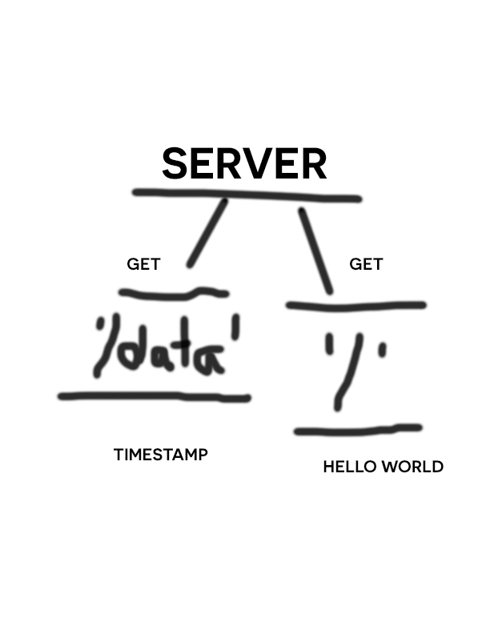

# server-deployment-practice

Simple express server with two routes that responds with a 'hello World' and timestamp.

## Deployment
- Production: https://tekjones-server-deploy-prod.herokuapp.com/
- Development: https://tekjones-server-deploy-dev.herokuapp.com/

## Routes

### /
- no parameters
- String response 'Hello World'

### /data
- no parameters
- json response {
    10: "even",
    5: "odd",
    "time": req.timestamp // we got this from the middleware
  }

